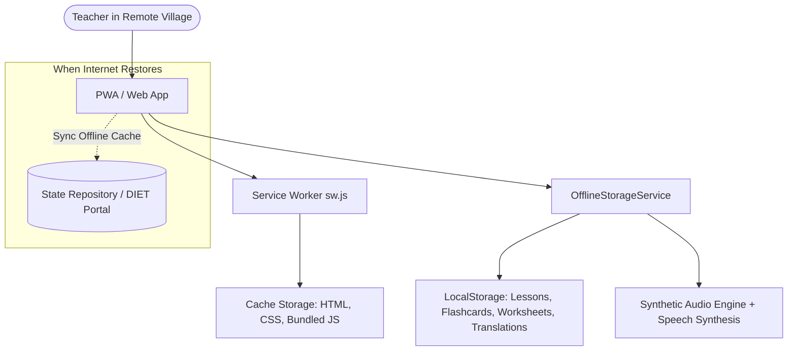

# TribalBridge AI (AI – Mother Tongue Teaching Assistant)

> **"Teaching beyond language barriers."**  
> An AI-powered, offline-first multilingual teaching assistant designed specifically for primary school teachers in tribal districts of Jharkhand (supporting **Hindi**, **Santhali [Ol Chiki & Latin]**, **Ho [Warang Chiti]**, and **Mundari**).

---

## 🌟 1. Project Overview

In tribal-dominated regions of Jharkhand (such as Khunti, West Singhbhum, Dumka, and rural Ranchi), non-tribal primary teachers frequently face a profound **language barrier** with young children entering Grade 1 whose sole mother tongue is **Santhali (ᱥᱟᱱᱛᱟᱲᱤ)**, **Ho (𑢹𑣉𑣉)**, or **Mundari (मुंडारी)**. While teachers instruct in standard Hindi, children cannot comprehend instructions, leading to early school anxiety, poor comprehension, and dropouts.

**TribalBridge AI** bridges this pedagogical divide by empowering teachers to:
1. Instantly translate classroom instructions and lesson concepts into the students' mother tongue.
2. Conduct real-time voice-assisted lessons where spoken Hindi is broadcast to students in Santhali.
3. Automatically generate child-friendly, bilingual worksheets with visuals and local tribal vocabulary.
4. Use interactive 3D visual flashcards with phonetic pronunciation audio.
5. Operate completely **offline** in remote forest schools with zero cellular connectivity.

---

## ✨ 2. Key Features & Page Walkthrough

### 🚀 Landing & Instant Demo Screen
- **Dual Access Modes**: Secure sign-in for registered government teachers (`T-JHK-8921`) and a 1-click **"Continue Demo"** button for immediate evaluators/hackathon review.

### 📊 Page 1 — Teacher Dashboard
- **Welcome & Identity**: Displays teacher name, school (*Utkramit Madhya Vidyalaya, Torpa*), and primary tribal language.
- **4 Real-time Metrics**: Today's Lessons (3), Translations Used (24), Worksheets Created (5), Offline Content Cached (18 items / 420 MB).
- **Quick-Start Section**: 1-click shortcuts to Translate, Voice Classroom, Worksheet Generator, and Flashcards.
- **Today's Lesson Spotlight**: Direct launch into *Numbers 1–10 (गिनती 1 से 10)* with quick number previews (Mit', Bar, Pe, Pon, Mõṛẽ).
- **Recent Activity Feed**: Chronological log of recent classroom translations and worksheet generations.
- **Offline Readiness Card**: Live indicator validating that all foundational resources are cached locally.

### 🌐 Page 2 — AI Lesson Translator
- **Context-Aware Translation**: Select from 5 pedagogical contexts (*Lesson, Classroom Instruction, Question, Activity, Assessment*).
- **Multilingual Script Support**:
  - **Ol Chiki Script (ᱚᱞ ᱪᱤᱠᱤ)**: Authentic, clean Santhali script for authentic learning.
  - **Phonetic Pronunciation Guide**: Romanized transliteration helping Hindi-speaking teachers pronounce Santhali accurately.
  - **Devanagari Script Representation**: Optional Devanagari transliteration for teachers who cannot read Ol Chiki yet.
- **Tools**: One-click Copy, standard Web Audio / Speech Synthesis player, and **Save Offline** button.
- **Informational AI Confidence Badge**: Clear 96% demo confidence indicator.
- **Linguistic Quality Note**: Explicit disclaimer reminding educators to verify AI translations with native speakers before high-stakes exams.

### 🎙️ Page 3 — Voice Classroom (Simulation)
- **Live Classroom Voice Flow**: Large interactive central microphone with realistic state transitions (*Tap to speak → Listening... → Translating... → Playing translated audio*).
- **Dynamic Waveform**: Responsive CSS audio visualizer that pulses during speech input.
- **Classroom Chat Stream**: Side-by-side bubble log of teacher's Hindi statements and students' Santhali responses with replay audio buttons.
- **Demo Performance Card**: Displays `< 3 seconds target` latency benchmark.
- **"How It Works" Flow**: Interactive 5-step diagram:
  $$\text{Hindi Voice} \rightarrow \text{Speech Recognition} \rightarrow \text{AI Translation} \rightarrow \text{Santhali Text} \rightarrow \text{Santhali Audio}$$

### 📚 Page 4 — Lesson Library
- **Core Curriculum Coverage**: Mathematics, Environmental Studies (EVS), Science, Language, and General Knowledge.
- **Pre-Seeded Interactive Lessons**:
  1. *Numbers 1–10* (Grade 1 Math)
  2. *Animals Around Us* (Grade 2 EVS)
  3. *Parts of a Plant* (Grade 3 Science)
  4. *Basic Shapes* (Grade 1 Math)
  5. *Importance of Water* (Grade 2 EVS)
  6. *Colors in Nature* (Grade 1 Language)
- **Interactive Presentation Mode**: Teachers can tap **"Start Teaching"** to project full-screen classroom flash slides with large fonts and audio buttons for each sentence.

### 📝 Page 5 — AI Worksheet Generator
- **Multi-Format Generator**: Generates Picture-Based counting questions, Multiple Choice (MCQ), Fill in the Blanks, and True/False.
- **Child-Friendly Visuals**: Incorporates clear emojis ($🍎, 🐘, ⭐, 🌳, 🐟$).
- **Print & PDF Support**: Includes custom `@media print` stylesheets. Tapping **Print Worksheet** or **Download PDF** opens a clean, border-formatted worksheet ready for student physical distribution.
- **Teacher Answer Key**: Toggleable answer explanations for classroom correction.

### 🎴 Page 6 — Visual Flashcards
- **Child-Centric 3D Flip Card**: Front features large child-friendly visuals and Hindi; back features Ol Chiki script, Romanized phonetics, contextual sentence usage, and Santhali pronunciation audio.
- **Classroom Controls**: Shuffle deck, Next, Previous, and **Save to Offline Deck**.
- **Student Reward**: Celebratory confetti effect upon completing deck reviews.

### 💾 Page 7 — Saved Offline Library
- **Zero-Network Architecture**: Caches Lessons, Worksheets, Flashcards, Audio Packs, and Translations directly in browser `LocalStorage` and `CacheStorage`.
- **Accurate Storage Meter**: Displays `"Used: 420 MB / 2 GB (21% capacity)"` with categorized breakdown.
- **Simulation Switch**: Prominent **"Offline Mode"** toggle in the navbar to test app resilience when internet is switched off.

### ⚙️ Page 8 — Settings & Accessibility
- **Teacher Profile**: Editable teacher name, school name, and district (*Khunti, Ranchi, West Singhbhum, Dumka*).
- **Audio Control**: Voice speed slider ($0.6\times$ to $1.3\times$), speaker volume, and auto-play toggle.
- **Hardware Accessibility for Low-Cost Android Tablets**:
  - **Large Text Mode**: Upscales font size by 15% across all headings, buttons, and lesson texts.
  - **High Contrast Mode**: Enhances borders and background contrast for outdoor daylight reading in rural schoolyards.
  - **Simplified Interface**: Removes technical terminology for non-tech-savvy teachers.

### 🏛️ Bonus — Admin & Government Oversight Dashboard
- **Regional Deployment Metrics**: 120 Total Schools, 486 Active Teachers, 340 Lessons Available, 1,240 Offline Resources.
- **Analytical Charts**:
  - Subject breakdown (Mathematics 32%, EVS 28%, Science 19%, Language 13%, GK 8%).
  - Language distribution (Santhali 62%, Ho 22%, Mundari 16%).
  - District offline readiness tracker (*Khunti, Ranchi, West Singhbhum, Dumka*).

---

## 🛠️ 3. Technology Stack

- **Framework**: React 18 + TypeScript
- **Bundler**: Vite
- **Styling**: Tailwind CSS + Custom tribal color palettes (`#16a34a`, `#d97706`, `#ea580c`)
- **Icons**: Lucide React
- **Audio & Speech**: Browser SpeechSynthesis API + Web Audio API oscillator synthesis
- **Delight & Animations**: `canvas-confetti`
- **Offline / PWA**: Web App Manifest (`manifest.json`), Service Worker (`sw.js`), LocalStorage cache manager

---

## 💻 4. How to Run Locally

### Prerequisites
- Node.js (v18 or higher; tested on v24)
- npm or pnpm

### Installation
```bash
# 1. Install dependencies
npm install

# 2. Start the local Vite development server
npm run dev
```

### Production Build
```bash
npm run build
npm run preview
```

---

## 📶 5. Offline Architecture



1. **Service Worker (`public/sw.js`)**: Intercepts HTTP requests and serves cached assets, allowing the entire single-page app to load without internet.
2. **Local Storage Engine (`src/services/offlineStorage.ts`)**: Persists saved translations, customized worksheets, teacher preferences, and cached audio markers.
3. **Simulated Offline Switch**: Evaluators can toggle the **"Online Sync" / "Offline Mode"** switch in the top header at any time to verify that zero dependencies require a live network.

---

## 🧠 6. Mock AI Architecture

The prototype decouples all AI intelligence into `src/services/aiService.ts`. This service implements:
- `translateText(hindiText, targetLang, context)`
- `generateWorksheet({ subject, grade, topic, questionType, count })`
- `generateFlashcards(topic, grade)`
- `speechToText(promptIndex)`
- `textToSpeech(text, phonetic)`

### Linguistic Grounding
Primary school vocabulary for Santhali numbers, animals, nature, and common classroom directions are grounded in authentic lexicographical data (`src/data/authenticVocab.ts`) using the **Ol Chiki** script, Latin phonetics, and Devanagari equivalents. When a novel phrase is entered, the engine produces structured linguistic prototypes clearly marked with an AI advisory note.

---

## 🔌 7. How to Replace Mock AI with Real APIs

The modular `AIService` class can be upgraded to live production endpoints in under an hour:

### A. Connecting Google Gemini API (Worksheets & Flashcards)
```typescript
import { GoogleGenAI } from '@google/genai';

const ai = new GoogleGenAI({ apiKey: process.env.VITE_GEMINI_API_KEY });

// Replace generateWorksheet with Gemini 2.0 Flash structured JSON output:
const response = await ai.models.generateContent({
  model: 'gemini-2.0-flash',
  contents: `Generate a Grade 1 bilingual (Hindi and Santhali) worksheet on topic: ${topic}`,
  config: { responseMimeType: 'application/json' }
});
```

### B. Connecting Government of India Bhashini / IndicTrans2
For tribal neural machine translation:
```typescript
// Call Bhashini ULCA Translation Pipeline
const response = await fetch('https://nmt-api.bhashini.gov.in/v1/translate', {
  method: 'POST',
  headers: { 'Authorization': BHASHINI_API_KEY, 'Content-Type': 'application/json' },
  body: JSON.stringify({
    source_language: 'hi',
    target_language: 'sat', // Santhali
    text: hindiText
  })
});
```

### C. Connecting IndicWav2Vec / Whisper for Tribal ASR & TTS
Replace `aiService.speechToText()` with browser microphone streaming to an Indic ASR WebSocket or Web Audio recording piped to Bhashini's ASR pipeline.

---

## 🔮 8. Future Improvements

1. **Native Ol Chiki Handwriting Recognition**: Enabling tribal children to practice writing Ol Chiki letters on slate tablets with real-time AI stroke correction.
2. **Voice Cloning of Local Village Elders**: Allowing audio lessons to be voiced in the warm, familiar regional dialect of local gram panchayat elders.
3. **Physical QR Code Integration**: Printing QR codes on government paper textbooks that launch corresponding audio pronunciation cards offline on the teacher's phone.
4. **Offline Bluetooth P2P Sync**: Allowing teachers from adjacent villages to share newly generated worksheets and flashcards tablet-to-tablet without cellular internet.

---

*TribalBridge AI is dedicated to educational equity, language preservation, and joyful foundational learning for every child in Jharkhand.*
